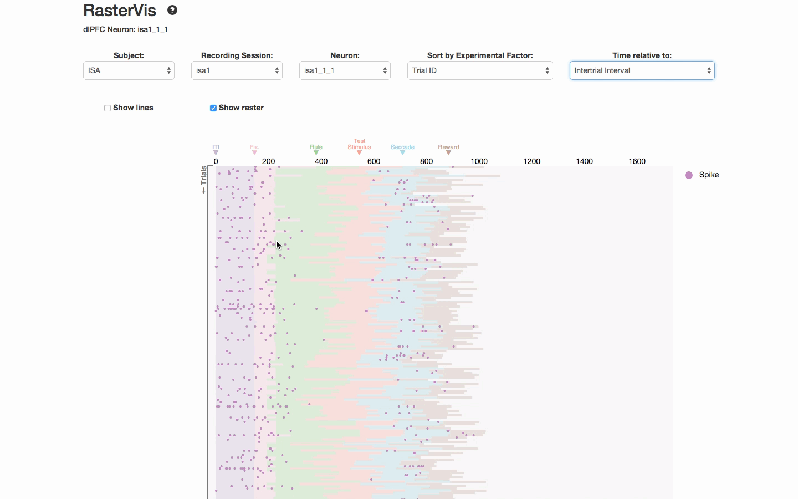
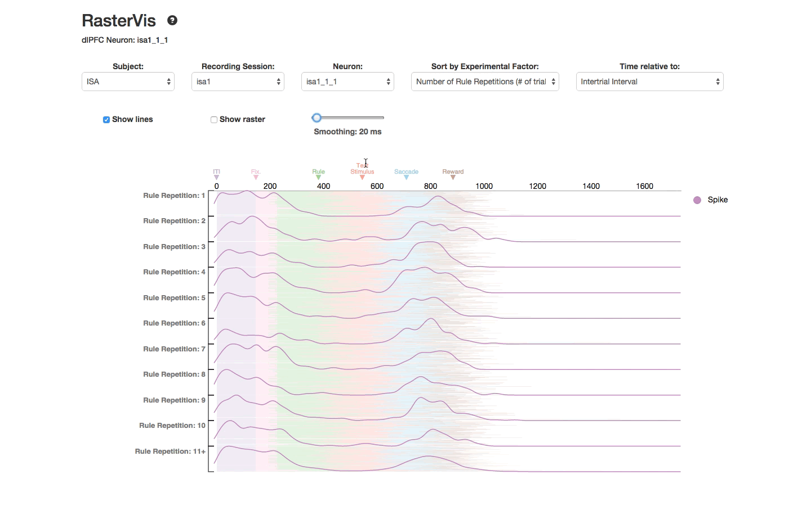

# The role of dynamic, interactive visualization of data in neuroscience

### Table of Contents
+ [The importance of visualizing data in neuroscience](#vis-importance)
+ [Limitations of static visualizations](#limitations-static)
+ [Dynamic visualizations can help us understand large quantities of data](#dynamic-vis)
+ [Interactive visualizations can help us quickly make comparisons](#interactive-vis)
+ [Prior work in neuroscience visualization software](#prior-work)
+ [RasterVis](#raster-vis)
+ [SpectraVis](#spectra-vis)
+ [glmVis](#glm-vis)
+ [Limitations of dynamic, interactive visualizations](#limitations-dynamic)
+ [Future Goals](#goals)

### The importance of visualizing data in neuroscience
Visualization is a fundamental tool for communication and understanding in neuroscience. Data visualization serves two primary purposes:

First, visualizing data aids in the understanding and checking of statistical assumptions -- it helps qualify our uncertainty about the data and the our model of the data. All statistical summaries rely on assumptions about the structure of the data, but inspection summaries alone cannot tell you about violations of those assumptions.

A canonical example of this is a set of four datasets known as Anscombe's Quartet [citation].

Each dataset consists of 11 observations of two variables -- *x* and *y*. The *x*- and *y*-variables have the same respective mean and variance between each dataset. Within each dataset, the *x*- and *y*-variables are also identically correlated and fit by the same regression line. However, visual inspection of the datasets reveal strikingly different structure in each dataset.

Second, visualizing data helps us make multiple, simultaneous comparisons. While it is perceptually easy to compare a few numbers, this becomes more difficult as the amount of data displayed increases. Effective visualization eases the cognitive burden of comparison and helps us more quickly understand claims about the data.

### Limitations of static visualizations

### Dynamic visualizations can help us understand large quantities of data

### Interactive visualizations can help us quickly make comparisons

### Prior work in neuroscience visualization software
+ [Jeremy Freeman](http://thefreemanlab.com/pdf/freeman-2014-nature-methods.pdf)
+ [pycortex webGL fMRI viewer](http://gallantlab.org/semanticmovies/)

### RasterVis
RasterVis is a D3-based visualization tool for quickly viewing, grouping and summarizing spike rasters for many neurons.

This tool allows you to:
* Generate and change between rasters for many neurons

* Quickly view rasters aligned to experimental trial events.

* Add Gaussian-smoothed peristimulus time kernel density estimates with arbitrary smoothing.

* Group spikes based on experimental factors.

### SpectraVis

### glmVis

### Limitations of dynamic, interactive visualizations

### Future Goals
