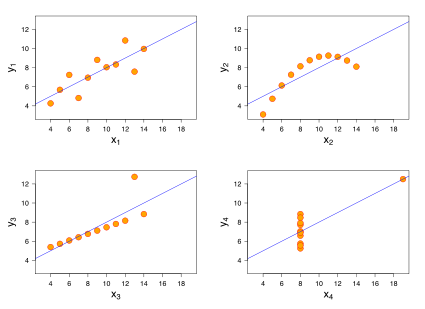

# The role of dynamic, interactive visualization of data in neuroscience

### The importance of visualizing data
Data visualization is a fundamental tool for communication and analysis in neuroscience. Visualization serves two primary purposes:

First, visualizing data aids in the understanding and checking of statistical assumptions -- it helps qualify our knowledge and uncertainty about the data. All statistical summaries rely on assumptions about the structure of the data (our implicit/explicit model of the data), but inspection of summaries alone cannot tell you about violations of those assumptions. Visualization of data complements the use of statistical summaries by revealing differences between the expected structure of the data and the observed data [Gelman 2004]. This is important, from the initial stages of analysis to publication, for revising our assumptions and models and for understanding and communicating where and how often models might fail.

A canonical example of this is a set of four datasets known as Anscombe's Quartet [Anscombe 1973].

Each dataset consists of 11 observations of two variables -- *x* and *y*. The *x*- and *y*-variables have the same respective mean and variance between each dataset. Within each dataset, the *x*- and *y*-variables are also identically correlated and fit by the same regression line. However, visual inspection of the datasets reveal strikingly different structure in each dataset (Figure 1). In particular, the second and third dataset (going clockwise around Figure 1) show a suspiciously quadratic pattern and a pattern driven by a single datapoint, respectively.

Second, visualizing data helps us quickly make multiple, simultaneous comparisons. While it is perceptually easy to compare a few numbers, this becomes more difficult as the amount of data displayed increases. Data visualization eases the cognitive burden of comparison, allowing for more efficient discovery of patterns and communication of claims about the data.

### Limitations of static visualizations
Static visualizations -- visualizations where viewers cannot change the state of the visualization by interacting with it -- have been the *de facto* standard for communicating and analyzing data in neuroscience. Static visualizations appear at the early stages of analysis in examining raw signals (e.g. voltage changes on an electrode, BOLD signals in fMRI), in communicating preliminary results of analyses and in more refined versions in publication.

Increases in technology and computing have made generating static visualizations relatively easy, but those same increases have led to more data, more complex analyses and more complex hypotheses. In electrophysiology, implantation of multielectrode arrays with upwards of 100 electrodes are becoming common [Miller and Wilson 2008, Einevoll et al. 2012?, Boyden?] and the number of simultaneously recorded neurons is projected to double every seven years [Stevenson and Kording 2011]. Laminar recordings have also become standard and add a spatial dimension of data per electrode. In fMRI, the amount of data per brain is already high and there have been efforts to scan more than 1000 subjects [Van Dijk et al 2012, etc].

Consequently, analyses are more complex, because with more data, there is greater statistical power to resolve finer differences in the data; we can partition the data into smaller subsets and still not be overcome by noise. With greater ability to resolve differences in the data, we can ask more complex questions and form more complex hypotheses.

An example of this is electrocorticography studies in which grids of intracranial electrodes are placed across wide swaths of cortex. These grids span multiple brain areas and regions and can measure both local field potentials and action potentials. Given enough data, this allows us to ask questions about the properties at different spatial scales (multiunits, local field potentials, brain region summaries) and how they relate (e.g. correlation and coherence between spatial scales and between brain regions). Moreover, we can ask questions about how these change over time and/or relate to experimental conditions. This results in a high-dimensional partitioning of the dataset.

So why is this a problem for static visualizations? Complex analyses and hypotheses necessitate either greater summaries of the data in static visualizations (dimensionality reduction) or more static visualizations to deal with the number of dimensions -- often both. This proliferation of visualizations and added summarization, along with the sheer amount of data, hinders checking statistical assumptions at all stages of analysis -- from the initial stages of exploratory data analysis to publication.

In the initial stages of analysis, the large amount of data and the need to partition the data in many different ways means generating many visualizations to look at raw data in each dimension. Switching between many visualizations is costly because of time spent finding each visualization and ability to hold each visualization in mind makes it harder to make comparisons between expected and unexpected structure in the data.

After summarization of the data, comparisons between dimensions of the summarization as well as comparisons between the summary and raw data need to be performed. If the analysis is sufficiently complex, several visualizations may be needed to compare dimensions, again incurring switching cost.

### Dynamic visualizations can help us understand large quantities of data

### Interactive visualizations can help us quickly make comparisons and deal with complexity

### Prior work in neuroscience visualization software
+ [Jeremy Freeman](http://thefreemanlab.com/pdf/freeman-2014-nature-methods.pdf)
+ [pycortex webGL fMRI viewer](http://gallantlab.org/semanticmovies/)

### Limitations of dynamic, interactive visualizations

### RasterVis
RasterVis is a D3-based visualization tool for quickly viewing, grouping and summarizing spike rasters for many neurons.

This tool allows you to:
+ Generate and change between rasters for many neurons.
+ Quickly view rasters aligned to experimental trial events.
+ Add Gaussian-smoothed peristimulus time kernel density estimates with arbitrary smoothing.
+ Group spikes based on experimental factors.

### SpectraVis

### glmVis

### Future Challenges and Goals

### References
